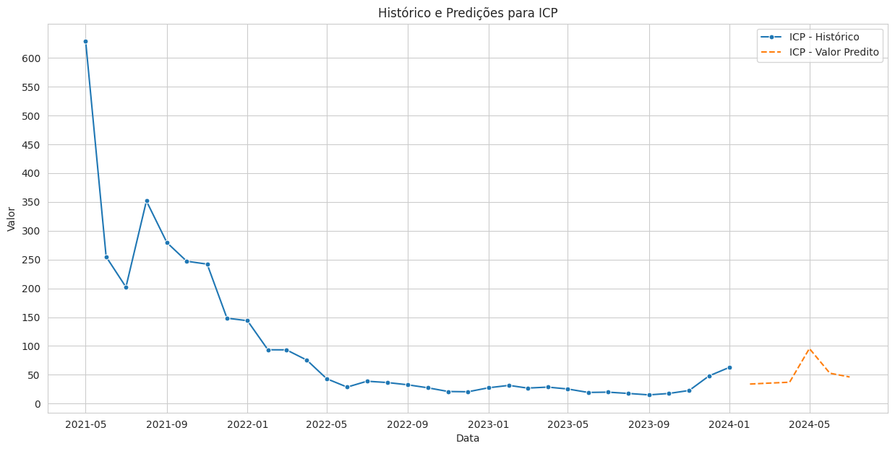

# Time Series Forecasting of Cryptocurrencies

O objetivo desse projeto é fazer prevsões os top 20 criptoativos em captalização de mercado. Sendo eles ```ADA, AVAX, BCH, BNB, BTC, DAI, DOGE, DOT, ETH, ICP, LINK, LTC, MATIC, SHIB, SOL, TON, TRX, USDC, USDT, XRP```. Ou seja, serão **vinte modelos** diferentes. Os dados utilizados foram coletados no ```Coinmarketcap```. 


O projeto foi dividido em três etapas: ```master```, ```functions``` e ```config```. O ```config``` é responsável por determinar todos os parâmetros e variáveis que serão usadas no pipeline, ```functions``` é onde todas as funções que serão usadas no pipeline estão, como ingestão de dados, processamento de dados, armazenamento, modelagem e previsão. O ```master``` é responsável por executar todo o pipeline.

Para acessar a aplicação, basta executar a ```demo.py```, e selecionar quais ativos e suas previsões quer visualizar.

 

## Resultados
Para validação, foram utilizados os ultimos oito pontos utilizando a abordagem **hold-out** e também **cross-validation**, e as métricas escolhidas foram o ```mape``` e o ```mae```. MAPE, ou Erro Percentual Absoluto Médio (em inglês, Mean Absolute Percentage Error), é uma métrica de desempenho comumente usada para avaliar a precisão de um modelo de previsão em relação aos valores reais. É especialmente útil em contextos de previsão de séries temporais, como previsões financeiras, de vendas ou de demanda. A fórmula do MAPE é dada por:

$MAPE = \frac{1}{n} \sum_{i=1}^{n} \left| \frac{Y_i - \hat{Y}_i}{Y_i} \right| \times 100$

Onde:
- $(n)$ é o número total de observações.
- $(Y_i)$ são os valores reais.
- $(\hat{Y}_i)$ são os valores previstos.

O MAPE calcula a média dos percentuais absolutos de erro para cada observação. Ele expressa o erro como uma porcentagem da magnitude real dos valores, proporcionando uma medida relativa de precisão. Quanto menor o valor do MAPE, melhor é o desempenho do modelo de previsão.

No contexto financeiro ou econômico, o MAPE é frequentemente usado para avaliar a precisão das previsões de séries temporais, como previsões de preços de ações ou taxas de câmbio. No entanto, é importante notar que o MAPE pode ter algumas limitações, como a sensibilidade a valores zero nos dados reais, e é sempre aconselhável considerar várias métricas de desempenho ao avaliar um modelo, como o MAE.

O Erro Médio Absoluto (MAE, do inglês Mean Absolute Error) é uma métrica que quantifica a média das diferenças absolutas entre os valores observados (reais) e os valores previstos em um modelo. O MAE representa a média das diferenças absolutas entre as previsões e os valores reais. Ou seja, valores mais baixos de MAE indicam que, em média, as previsões estão mais próximas dos valores reais. Um MAE próximo de zero sugere uma boa adequação do modelo, pois significa que as previsões estão próximas dos valores reais em média. Valores mais altos de MAE indicam que, em média, as previsões estão mais distantes dos valores reais.

O MAE é expresso na mesma unidade dos dados originais, tornando-o facilmente interpretável em termos práticos. Por exemplo, se estiver medindo vendas em dólares, um MAE de $10 significa que, **em média, as previsões têm um erro absoluto de $10** em relação aos valores reais. O MAE é **menos sensível a outliers** em comparação com o RMSE (Erro Quadrático Médio), pois não envolve a elevação ao quadrado dos erros (por isso não foi utilizado). Ele é útil para comparar o desempenho relativo de diferentes modelos, **especialmente quando os valores reais variam em grande amplitude**, como é o caso. Além disso MAE é uma métrica simples e fácil de interpretar, tornando-a uma escolha popular em muitas aplicações.


## Tabela de validação

| ticker | mape_sarima | mape_sarimax | mape_cv | mae_sarima | mae_sarimax | mae_cv |
|--------|-------------|--------------|---------|------------|-------------|--------|
| DAI    | 5.670075    | 14.467533    | 2.650308| 0.277119   | 0.708677    | 0.129174 |
| USDT   | 7.696967    | 22.603099    | 2.732995| 0.376337   | 1.108861    | 0.133417 |
| USDC   | 7.963068    | 1.433468     | 3.276416| 0.389791   | 0.069735    | 0.160348 |
| TRX    | 14.044310   | 41.930238    | 4.292657| 0.069533   | 0.195964    | 0.019844 |
| BTC    | 14.450785   | 43.185606    | 7.920819| 22800.108956| 74115.576692| 12718.244257 |
| TON    | 18.058879   | 215.112722   | 25.671161| 1.671489   | 19.457761   | 2.625065 |
| DOGE   | 19.416090   | 136.267667   | 20.647783| 0.075935   | 0.489655    | 0.076801 |
| XRP    | 22.325071   | 60.150914    | 15.274238| 0.648774   | 1.715588    | 0.436744 |
| LINK   | 29.873210   | 45.009988    | 34.926032| 15.905089  | 26.892435   | 15.065795 |
| ADA    | 34.364591   | 128.963710   | 24.024396| 0.619184   | 2.468409    | 0.442270 |
| BNB    | 38.154121   | 67.243913    | 14.146723| 435.891078 | 786.786060  | 175.191055 |
| ETH    | 42.015750   | 39.859773    | 22.332538| 3947.682168| 3923.110340 | 2067.259047 |
| LTC    | 43.429173   | 60.092082    | 21.143683| 153.044773 | 207.377738  | 79.377889 |
| MATIC  | 46.461459   | 236.894380   | 13.780892| 1.546034   | 8.260224    | 0.454354 |
| BCH    | 70.337658   | 114.963527   | 28.308773| 849.193294 | 1373.306185 | 362.082779 |
| AVAX   | 158.885801  | 451.124073   | 87.616703| 120.260318 | 391.126210  | 64.356766 |
| SOL    | 232.009651  | 57.570096    | 89.697974| 387.222808 | 96.381003   | 125.073977 |
| DOT    | 332.528335  | 246.659618   | 70.276301| 86.421786  | 57.321539   | 18.688865 |
| ICP    | 421.566771  | 6922.395599  | 123.337284| 100.603974 | 1672.767705 | 25.617233 |

* Ordenado pelo mape_sarima
* Apesar de termos valores altos de mape de 30% há ≃422%, é importante notar que **a variação percentual entre uma mesma variação absoluta entre valores menores e maiores vai ser maior para o valor menor**, como é o caso do preço do ICP em relação ao BTC. Note que, o Mean Absolute Error (MAE) é mínimo, sendo R$100 para o modelo arima e R$25 utilizando validação cruzada. É importante avaliar o desempenho de modelos sob várias métricas.



# Instruções de Uso
1. Clone este repositório em seu ambiente de desenvolvimento local. No Linux, abra o terminal e use o comando `git clone https://github.com/k3ybladewielder/crypto_forecast.git`. Windows, utilize o Git Bash ou o GitHub Desktop para clonar o repositório.
2. Crie seu ambiente virtual com o comando ```python3 -m venv env``` no Linux ou `python -m venv env` no Windows.
3. Inicialize seu ambiente virtual com o comand ```source env/bin/activate```. No Windows execute `.\env\Scripts\activate`.
4. Instale as bibliotecas necessárias do ```pip install -r requirements.txt```
5. Atualize as tabelas com os históricos, salvos no path `raw_data`. Certifique-se de ter os dados no diretório especificado e prossiga para o próximo passo.
6. Execute a aplicação para gerar as previsoes. No linux execute ```python3 master.py```, no Windows `python master.py`.
7. Execute a demo e visualize a aplicação. Exemplo: ```python3 demo.py```. No Windows execute `python demo.py`. Abra o link retornado pelo comando para acessar a aplicação no navegador.

## Roadmap
- [ ] Coleta de dados via API
- [X] Previsão Univariada
- [X] Previsão Multivariada
- [ ] Previsão com modelos de Bagging e Boosting
- [ ] Seleção dinâmica do melhor modelo (uni, multi, bagging, boosting) para cada ativo.
- [X] Validação
- [ ] Validação automatizada ao retreinar os modelos
- [X] Estruturação de previsões
- [X] Estruturação do código
- [X] Modularização
- [X] Demo
- [ ] Deploy

# Contribuições
Se você desenha contribuir com esse projeto com melhorias ou sugestões, sinta-se a vontade para abrir um pull request.

