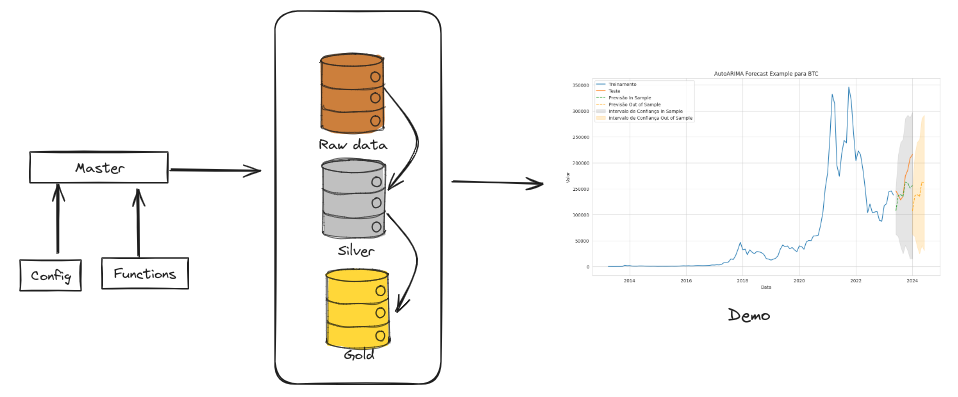
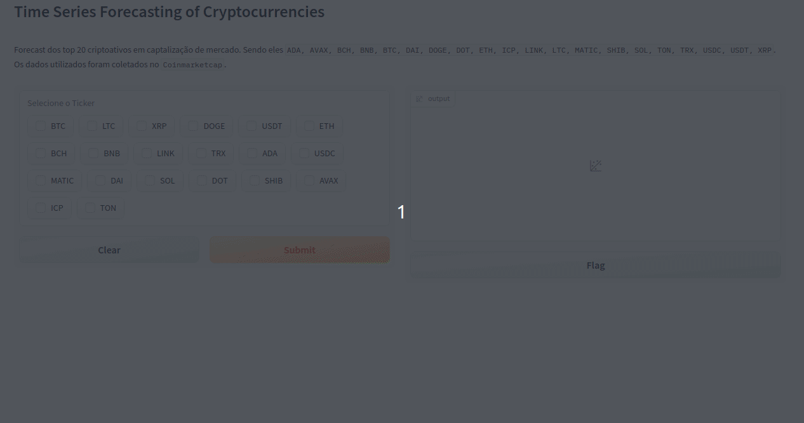
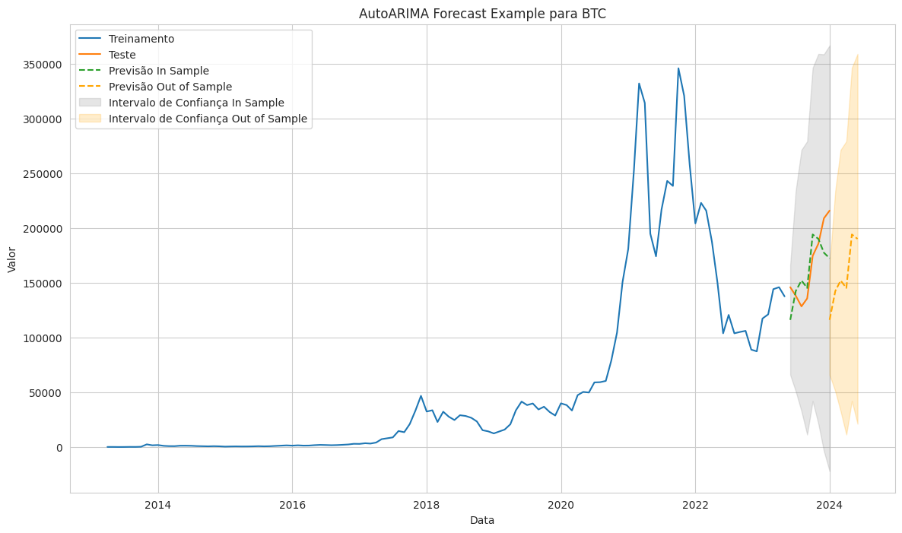

# Time Series Forecasting of Cryptocurrencies

## Overview
O objetivo desse projeto é fazer prevsões os top 20 criptoativos em captalização de mercado. Sendo eles ```ADA, AVAX, BCH, BNB, BTC, DAI, DOGE, DOT, ETH, ICP, LINK, LTC, MATIC, SHIB, SOL, TON, TRX, USDC, USDT, XRP```. Os dados utilizados foram coletados no ```Coinmarketcap```.



O projeto foi dividido em três etapas: ```master```, ```functions``` e ```config```. O ```config``` é responsável por determinar todos os parâmetros e variáveis que serão usadas no pipeline, ```functions``` é onde todas as funções que serão usadas no pipeline estão, como ingestão de dados, processamento de dados, armazenamento, modelagem e previsão. O ```master``` é responsável por executar todo o pipeline.

Para acessar a aplicação, basta executar a ```demo.py```, e selecionar quais ativos e suas previsões quer visualizar.

 

## Results
Para validação, foram utilizados os ultimos oito pontos e a métrica escolhida foi o ```mape```. MAPE, ou Erro Percentual Absoluto Médio (em inglês, Mean Absolute Percentage Error), é uma métrica de desempenho comumente usada para avaliar a precisão de um modelo de previsão em relação aos valores reais. É especialmente útil em contextos de previsão de séries temporais, como previsões financeiras, de vendas ou de demanda.

A fórmula do MAPE é dada por:

$MAPE = \frac{1}{n} \sum_{i=1}^{n} \left| \frac{Y_i - \hat{Y}_i}{Y_i} \right| \times 100$

Onde:
- $(n)$ é o número total de observações.
- $(Y_i)$ são os valores reais.
- $(\hat{Y}_i)$ são os valores previstos.

O MAPE calcula a média dos percentuais absolutos de erro para cada observação. Ele expressa o erro como uma porcentagem da magnitude real dos valores, proporcionando uma medida relativa de precisão. Quanto menor o valor do MAPE, melhor é o desempenho do modelo de previsão.

No contexto financeiro ou econômico, o MAPE é frequentemente usado para avaliar a precisão das previsões de séries temporais, como previsões de preços de ações ou taxas de câmbio. No entanto, é importante notar que o MAPE pode ter algumas limitações, como a sensibilidade a valores zero nos dados reais, e é sempre aconselhável considerar várias métricas de desempenho ao avaliar um modelo.



## Tabela de validação

| ticker | best_order | seasonal_order | mape      |
|--------|------------|-----------------|-----------|
| DAI    | [1, 0, 0]  | [3, 1, 0, 12]   | 7.836956  |
| LTC    | [1, 0, 0]  | [3, 1, 0, 12]   | 9.435255  |
| SOL    | [1, 0, 1]  | [2, 1, 1, 12]   | 9.659482  |
| USDT   | [1, 0, 0]  | [3, 1, 2, 12]   | 10.210693 |
| DOGE   | [1, 0, 0]  | [2, 1, 1, 12]   | 10.214730 |
| ETH    | [3, 0, 0]  | [2, 1, 1, 12]   | 10.346384 |
| ADA    | [1, 0, 0]  | [2, 1, 1, 12]   | 10.740474 |
| BCH    | [1, 0, 0]  | [3, 1, 0, 12]   | 10.743819 |
| BNB    | [1, 0, 0]  | [2, 1, 1, 12]   | 10.946921 |
| XRP    | [1, 0, 1]  | [3, 1, 0, 12]   | 10.993606 |
| MATIC  | [1, 0, 0]  | [2, 1, 1, 12]   | 11.252736 |
| TRX    | [4, 0, 0]  | [3, 1, 1, 12]   | 12.076602 |
| USDC   | [1, 0, 0]  | [3, 1, 0, 12]   | 12.209744 |
| BTC    | [1, 0, 1]  | [1, 1, 1, 12]   | 13.471350 |
| DOT    | [3, 0, 2]  | [2, 1, 1, 12]   | 13.770143 |
| LINK   | [2, 0, 1]  | [3, 1, 0, 12]   | 13.906275 |
| ICP    | [3, 0, 0]  | [2, 1, 1, 12]   | 16.385659 |
| SHIB   | [1, 0, 0]  | [2, 1, 0, 12]   | 16.673016 |
| AVAX   | [2, 0, 1]  | [0, 1, 1, 12]   | 17.435001 |
| TON    | [2, 0, 1]  | [0, 1, 1, 12]   | 30.972193 |

# Instruções de Uso
1. Clone este repositório em seu ambiente de desenvolvimento local. No Linux, abra o terminal e use o comando `git clone https://github.com/k3ybladewielder/crypto_forecast.git`. Windows, utilize o Git Bash ou o GitHub Desktop para clonar o repositório.
2. Crie seu ambiente virtual com o comando ```python3 -m venv env``` no Linux ou `python -m venv env` no Windows.
3. Inicialize seu ambiente virtual com o comand ```source env/bin/activate```. No Windows execute `.\env\Scripts\activate`.
4. Instale as bibliotecas necessárias do ```pip install -r requirements.txt```
5. Atualize as tabelas com os históricos, salvos no path `raw_data`. Certifique-se de ter os dados no diretório especificado e prossiga para o próximo passo.
6. Execute a aplicação para gerar as previsoes. No linux execute ```python3 master.py```, no Windows `python master.py`.
7. Execute a demo e visualize a aplicação. Exemplo: ```python3 demo.py```. No Windows execute `python demo.py`. Abra o link retornado pelo comando para acessar a aplicação no navegador.

## Roadmap
- [ ] Coleta de dados via API
- [X] Previsão Univariada
- [ ] Previsão Multivariada
- [ ] Previsão com modelos de Bagging e Boosting
- [X] Estruturação de previsões
- [X] Estruturação do código
- [X] Modularização
- [ ] Demo
- [ ] Deploy

# Contribuições
Se você desenha contribuir com esse projeto com melhorias ou sugestões, sinta-se a vontade para abrir um pull request.

